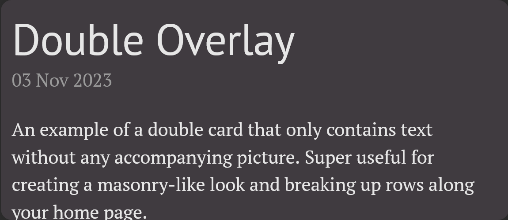
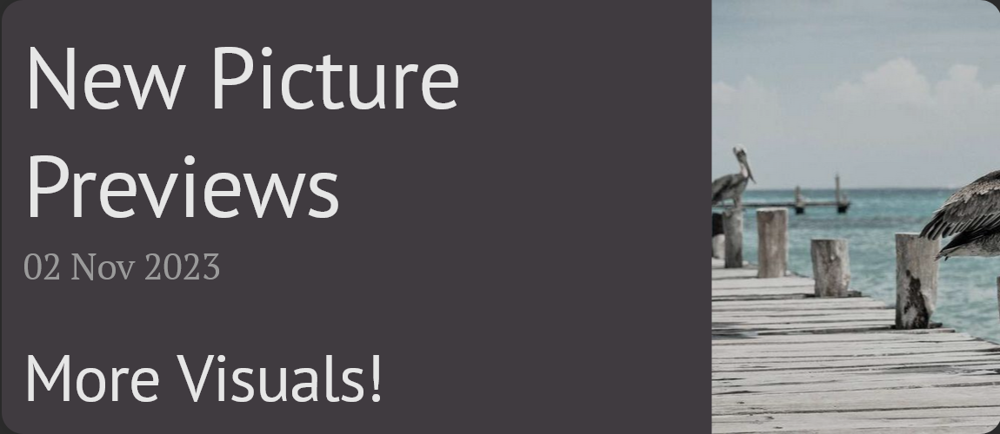
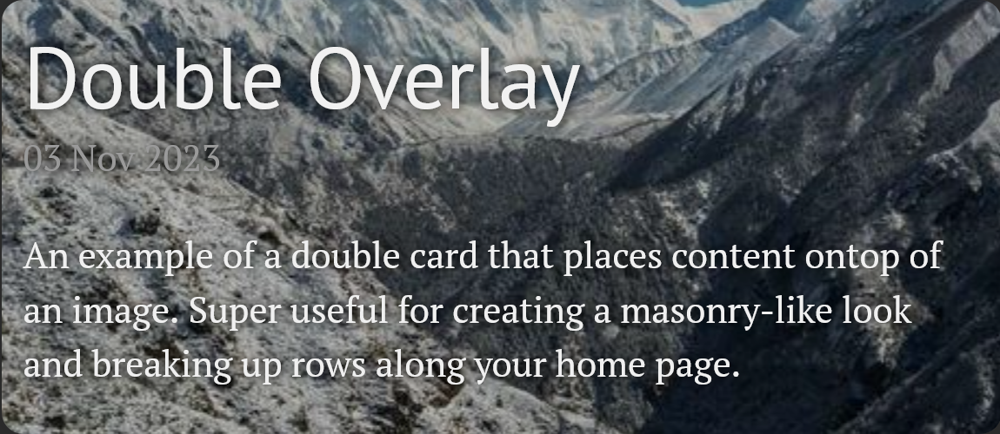

# Visual-Lanyon

Visual-Lanyon is a fork of [Lanyon](https://github.com/poole/lanyon) focused on redesigning the home page to create a more visuals-oriented experience. Visual Lanyon is a [Jekyll](http://jekyllrb.com) theme that provides a highly-specified home page layout without added complexity. For ease of reading only features that have been added or changed from Lanyon are detailed here. See [Lanyon's Documentation](https://github.com/poole/lanyon#usage) for more about how to get started. 


## Contents

- [Usage](#usage)
- [Cards](#cards)
  - [Card Placement](#card-placement)
- [Options](#options)
  - [Analytics](#analytics)
  - [Themes](#themes)
  - [Bio](#bio)
- [Author](#author)
- [License](#license)


## Usage

Visual-Lanyon is a fork of [Lanyon](https://github.com/poole/lanyon), which itself is built on top of [Poole](https://github.com/poole/poole). Poole provides a fully furnished Jekyll setup—just download and start the Jekyll server. See [the Poole usage guidelines](https://github.com/poole/poole#usage) for how to install and use Jekyll.

## Cards

Visual-Lanyon creates a more browsable, image oriented, and modern homepage compared to Lanyon. The main component of this homepage are 'Cards'. Cards typically are self-contained previews of your posts, which contain the post title, date, excerpt, and optionally an image. Think of pinterest. 

Visual-Lanyon provides multiple card presets. The style of card can be specified in the front-matter of each post, or a default may be specified in _config.yml. 
The provided card presets are:
- small
- double
- wide
- large
- tall
- square

Preview images (placed within each card) are specified within the front-matter of each post by specifing a resource location in the 'image' field. If the 'image' field is left blank then no preview image is displayed. Lastly, preview images can either be displayed adjacent to the post excerpt, or as the background of the card. This option is specified within the 'overlay' field. Examples of correctly formated double cards and their corresponding output are shown below:

#### Double Wide - No Image  
_post.md_
```yml
---
layout: post
title: Double Overlay
preview: double_card
---
```


#### Double Wide - Adjacent Image  
_post.md_
```yml
---
layout: post
title: Double Overlay
preview: double_card
image: https://picsum.photos/640/320
overlay: false
---
```



#### Double Wide - Overlayed Image  
_post.md_
```yml
---
layout: post
title: Double Overlay
preview: double_card
image: https://picsum.photos/640/320
overlay: true
---
```



### Card Placement

By default only 10 cards are shown on each page, this can be changed by replacing the value for paginate in _config.yml. 

Visual-Lanyon may be used to visually approximate the currently under-development Masonry grid standard in CSS. However, in order to avoid costly Javascript while remaining widely supported, cards are placed left to right, top to bottom across the home page, with the most recent cards being placed first. Cards take up a set amount of space, determined by their type, and subsequent cards are pushed to accomodate this space. This may lead to wacky placing when not carefully selecting card types, so depending on the desired style may be best to only use one or two card styles for posts. 


## Options

Visual-Lanyon adds several new customization options to Lanyon's customization options. These options are typically configured within the _config.yml file. These options are detailed below. To see more about Lanyon's options see (https://github.com/poole/lanyon#readme).

### Analytics

Visual Lanyon addes the ability to track analytics using [GoatCounter](https://www.goatcounter.com/), an open-source web analytics platform that is privacy friendly. GoatCounter can easily be set up by creating an account [here](https://www.goatcounter.com/signup) and providing your GoatCounter code in the configs file. To use Google Analytics see the documentation from [Lanyon](https://github.com/poole/lanyon)

### Themes

Themes control the feel of Visual-Lanyon by changing the color of various elements. Visual-Lanyon supports two themes, light and dark, that can each seperately be fully configured.
Themes specify:
- Background Color
- Sidebar Color
- Card (Background) Color
- Title Text Color
- Secondary Title Text Color
- Link Color
- Quote Block Background Color

Unlike Lanyon, Visual-Lanyon moves away from themes from being specified as a class in \<body\>. Rather, color values are specified in scss/themes.scss. Colors may be specified by Hex, RGB, or HTML color codes. <br>

Visual-Lanyon ships with these defaults:

Light Theme:
```scss
$light-background-color: #FFFFFF;
$light-sidebar-color: #4b4b4b;
$light-card-color: #fefdfe;
$light-title-color: #303030;
$light-alt-title-color: #9a9a9a;
$light-link-color: #268bd2;
$light-highlight-background: rgba(0, 0, 0, 0.05);
```

Dark Theme:
```scss
$dark-background-color: #2d2d2d;
$dark-sidebar-color: #BB86FC;
$dark-card-color: #403b40;
$dark-title-color: #e6e6e6;
$dark-alt-title-color: #9a9a9a;
$dark-link-color: #BB86FC;
$dark-highlight-background: rgba(0, 0, 0, 0.15);
```

Color values are stored as SASS variables at the begining of css/themes.scss. If you are unfamiliar with SASS see [their documentation](https://sass-lang.com/documentation/) for more information. 

### Bio

Author biographic information can be included in the sidebar by configuring _config.yml. This information includes author name, profile pic, and short about section. This section can be omitted by having empty values for *both* author name and profile pic.
The relevant sections of the config file are:

```yml
# About/contact
author:
  name: Author Name       
  pic:  https://as2.ftcdn.net/v2/jpg/05/86/91/55/1000_F_586915596_gPqgxPdgdJ4OXjv6GCcDWNxTjKDWZ3JD.jpg          
  about: 'A short bio about you, the author'
```

In addition social media links can included below the author bio section. These links are configured in the _data/social-media.yml file. Presets for email, Github, LinkedIn, Twitter, Facebook, Instagram, Youtube, Twitch, Discord are included in the file. To omit a site simply leave an empty value for ID. Additional social media links can be configured using the basic format below.

```yml
NetworkName:
  id: 'your-Username-or-ID'
  href: 'link to site / profile /' #id will be appended to this to create the final link
  title: 'Name of Network'
  icon: 'display icon svg'
```


## Author

**ZaMan8**
- <https://github.com/Zaman8>


## License

Open sourced under the [MIT license](LICENSE.md).